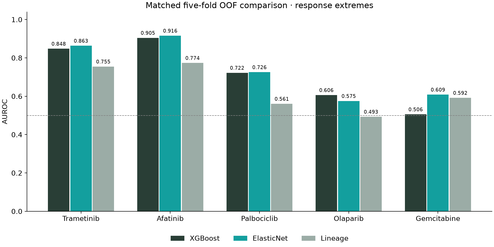
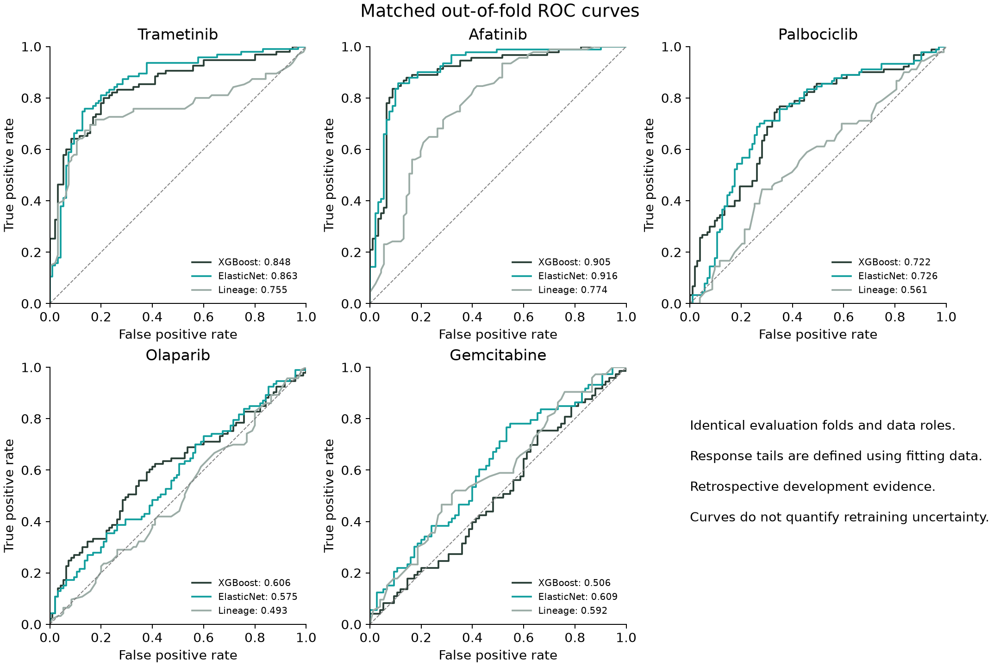
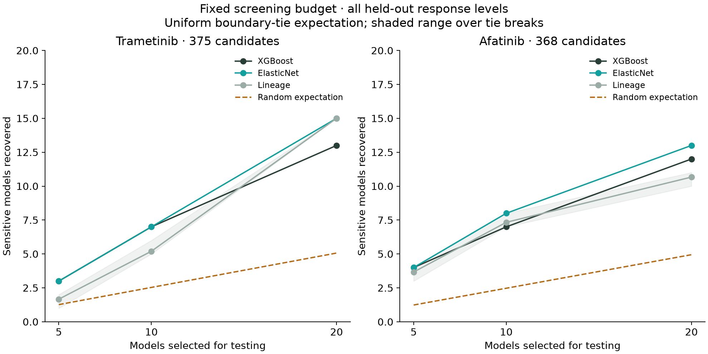
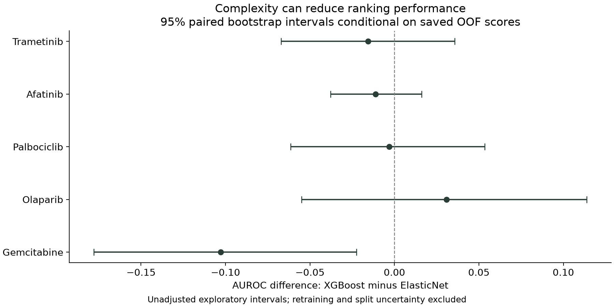
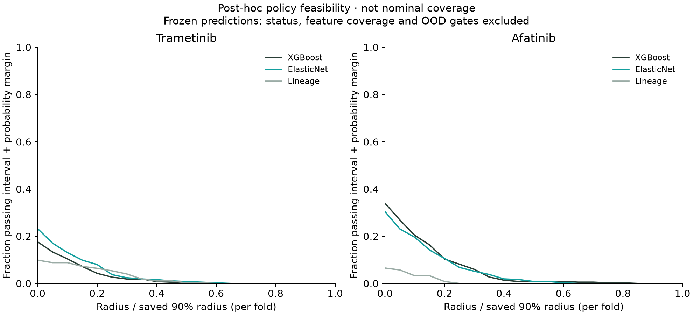
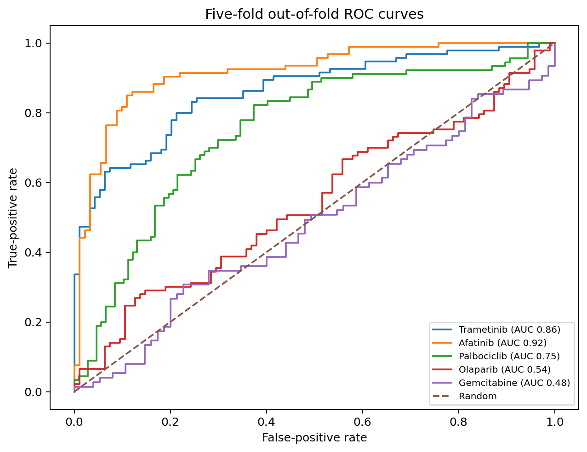
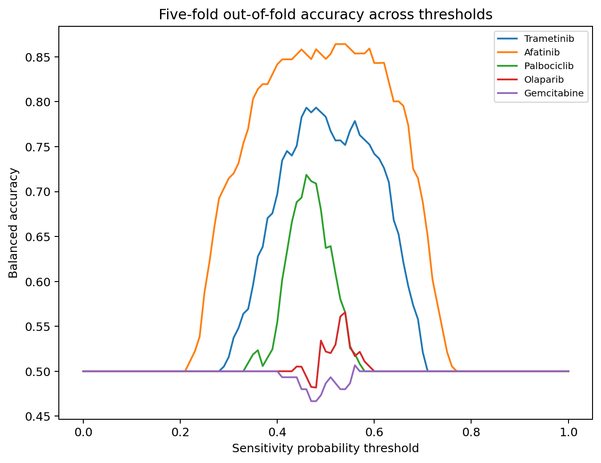
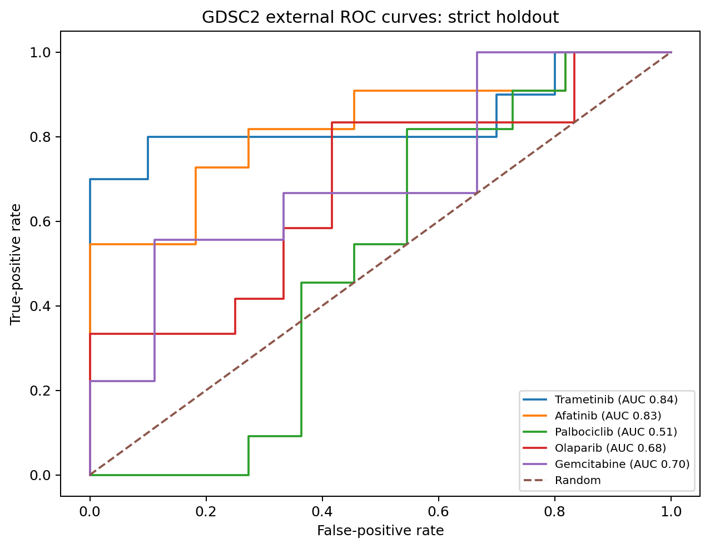

[](https://github.com/rsolerortuno/DrugMatch-Confidence/actions/workflows/ci.yml)
[](https://www.python.org/)
[](LICENSE)
[](https://depmap.org/portal/data_page/?tab=currentRelease)

# DrugMatch-Confidence

**An interpretable XGBoost tool that predicts drug sensitivity in preclinical cancer cell lines and reports when its prediction should not be trusted.**

## September 2026 update

The [evidence review](docs/PIERRE_FABRE_REVIEW.md) adds independent calibration, explicit abstention, matched OOF baselines and an experimental-budget analysis. In matched OOF evaluation, XGBoost AUROC is **0.848 / 0.905** for trametinib / afatinib; the linear baseline reaches **0.863 / 0.916**. There is no demonstrated XGBoost advantage over that baseline. The strict interval-support policy is inoperative on those saved predictions; a [feasibility audit](docs/PIERRE_FABRE_REVIEW.md#interval-policy-feasibility-not-validated-abstention) explains why. The useful current output is experimental ranking. For gemcitabine, XGBoost loses **0.103 AUROC** to ElasticNet (unadjusted conditional 95% interval **−0.178 to −0.022**).

New bundles are in `models/review/` and remain unreviewed. The sections explicitly marked historical document the v1.0 release; they must not be used as validation of the revised protocol. See the [MAPK experiment plan](docs/MAPK_EXPERIMENT_PLAN.md) and [machine-readable review](reports/pierre_fabre_review/matched_summary.csv).

The bundled models require **Python 3.12+**. Core scientific dependencies are pinned to the recorded training environment; upgrading serialized-model dependencies requires revalidation.

## Current review figures (1.1.0.dev0)

These plots are regenerated from the committed matched-review tables, without retraining:







At a trametinib budget of ten models, XGBoost and ElasticNet each recover seven sensitive models, versus **5–6 for lineage depending on boundary ties (5.2 expected)** and 2.53 expected at random. At twenty models the ordering changes. These are retrospective ranking results, not prospective experimental validation or evidence for automatic treatment decisions.





Regenerate with `python scripts/generate_review_figures.py`. The [verification report](reports/TEST_REPORT.md) records the checks for this revision. Historical figures below remain available for comparison with v1.0.

## The idea

Cancer cell lines are laboratory models of tumours. Researchers can measure thousands of genes in each model and experimentally test whether a drug kills it. DrugMatch-Confidence learns the relationship between those molecular measurements and the observed response to a drug.

For one cell line and one supported drug, the tool returns:

- a predicted continuous response;
- a screening decision: **sensitive**, **resistant**, or **abstain**, with reasons;
- the response zone implied by the continuous regressor;
- whether the regression and classification heads agree;
- a calibrated probability;
- an uncertainty interval;
- an out-of-distribution warning;
- the molecular features that pushed the prediction in either direction.

> **Preclinical research only.** These models were trained on cancer cell lines, not patients. They must not be used to choose treatment for a person.

## Historical v1.0 results

The repository contains five real DepMap/PRISM XGBoost bundles. They are not presented as equally strong.

| Drug | Release status | 5-fold OOF AUROC | OOF balanced accuracy | Strict GDSC2 AUROC | Strict GDSC2 n | Interpretation |
|---|---|---:|---:|---:|---:|---|
| Trametinib | `validated_demo` | 0.86 | 0.78 | 0.84 | 20 | Recommended as the main portfolio demonstration. |
| Afatinib | `validated_demo` | 0.92 | 0.85 | 0.83 | 22 | Recommended as the main portfolio demonstration. |
| Palbociclib | `exploratory` | 0.75 | 0.64 | 0.51 | 22 | Useful research signal, but transfer is not sufficiently stable for the main claim. |
| Olaparib | `insufficient_evidence` | 0.54 | 0.52 | 0.68 | 24 | Included as a documented negative/weak result; do not use as a reliable predictor. |
| Gemcitabine | `insufficient_evidence` | 0.48 | 0.49 | 0.70 | 18 | Included as a documented negative/weak result; do not use as a reliable predictor. |

The main portfolio demonstrations are **trametinib** and **afatinib**. Palbociclib is retained as an exploratory example. Olaparib and gemcitabine are deliberately kept as documented weak/negative results, showing that the pipeline does not hide failure or force XGBoost to appear successful.

## Historical v1.0 validation figures

### Five-fold out-of-fold ROC curves

Each sample is predicted by a model that did not train on that sample. These are historical scores; the new matched comparison is linked above.



### Accuracy across probability thresholds

This figure uses **balanced accuracy**, which gives equal importance to sensitive and resistant classes. It shows why the decision threshold is selected on validation data instead of automatically using 0.50.



### Independent GDSC2 validation

The strict analysis evaluates only cell lines that were already locked in the PRISM internal test set. GDSC2 outcomes were never used for feature selection, tuning, calibration or threshold selection.



More figures and machine-readable metrics are available in [`reports/`](reports/).

## What data were used?

| Data source | Files used | What they contribute | Official link |
|---|---|---|---|
| DepMap Public 26Q1 | `OmicsExpressionTPMLogp1HumanProteinCodingGenes.csv` | Baseline RNA expression | [DepMap current release](https://depmap.org/portal/data_page/?tab=currentRelease) |
| DepMap Public 26Q1 | `OmicsSomaticMutationsMatrixDamaging.csv` | Likely loss-of-function mutations | [DepMap current release](https://depmap.org/portal/data_page/?tab=currentRelease) |
| DepMap Public 26Q1 | `OmicsSomaticMutationsMatrixHotspot.csv` | Activating cancer hotspot mutations | [DepMap current release](https://depmap.org/portal/data_page/?tab=currentRelease) |
| DepMap Public 26Q1 | `PortalOmicsCNGeneLog2.csv` | Gene-level copy number | [DepMap current release](https://depmap.org/portal/data_page/?tab=currentRelease) |
| DepMap Public 26Q1 | `OmicsGlobalSignatures.csv` | MSI, ploidy, CIN, WGD, LOH and aneuploidy | [DepMap current release](https://depmap.org/portal/data_page/?tab=currentRelease) |
| DepMap Public 26Q1 | `Model.csv` | Stable model IDs and tumour lineage | [DepMap current release](https://depmap.org/portal/data_page/?tab=currentRelease) |
| PRISM secondary screen | Dose-response curve parameters | Training outcome: measured drug-response AUC | [PRISM Repurposing](https://depmap.org/repurposing/) |
| GDSC2 | `GDSC2_fitted_dose_response_27Oct23.xlsx` | Independent external response outcome | [Cell Model Passports downloads](https://cellmodelpassports.sanger.ac.uk/downloads) |
| Cell Model Passports | model and compound exports | Cross-dataset ID and compound mapping | [Cell Model Passports downloads](https://cellmodelpassports.sanger.ac.uk/downloads) |

A checksum and provenance manifest for every real training input is stored in [`data/manifests/real_training_inputs.json`](data/manifests/real_training_inputs.json). Large source datasets are not redistributed in this repository.

For a non-technical explanation of every file, see [`docs/DATA_FOR_NON_EXPERTS.md`](docs/DATA_FOR_NON_EXPERTS.md).

## How the pipeline works

```text
DepMap molecular data                  PRISM measured drug response
(expression, mutations, CN, lineage)            (AUC)
                 \                              /
                  \                            /
                   ---- stable ModelID join ----
                                |
                   grouped train/validation/test split
                                |
                   feature selection on training only
                                |
           baselines + Elastic Net + XGBoost regression/classification
                                |
             calibration + conformal interval + OOD detector + SHAP
                                |
             five-fold out-of-fold validation and frozen GDSC2 test
```

The essential safeguards are:

1. **Cell-line grouping:** the same model cannot appear in both training and test data.
2. **Training-only feature selection:** test data never choose genes.
3. **Locked external validation:** GDSC2 never changes the model.
4. **Explicit baselines:** XGBoost is compared with lineage-only and Elastic Net models.
5. **Honest release labels:** weak models remain visible but are not recommended.

A step-by-step explanation is in [`docs/HOW_IT_WORKS.md`](docs/HOW_IT_WORKS.md).

## Quick start

### 1. Install

```bash
git clone https://github.com/rsolerortuno/DrugMatch-Confidence.git
cd DrugMatch-Confidence
python -m venv .venv
source .venv/bin/activate          # Windows: .venv\Scripts\activate
python -m pip install --upgrade pip
python -m pip install -e ".[app,dev]"
```

For development and tests without the Streamlit interface, install `'.[dev]'` instead. This extra explicitly includes PyArrow for Arrow-backed identifier tests; CI quality checks use this installation.

### 2. Check the package

```bash
python -m drugmatch --help
pytest -q
```

### 3. Run a review-model prediction

```bash
drugmatch predict \
  --model models/review/depmap_26q1_prism/trametinib.joblib \
  --features examples/trametinib_example_input.csv \
  --output examples/trametinib_example_prediction.json
```

Review bundles remain `unreviewed`: the screening decision will abstain. Continuous predictions and rankings are research outputs. Historical bundles remain available under `models/real/`.

### 4. Launch the app

```bash
drugmatch app
```

The Streamlit interface shows the prediction, probability, interval, OOD status, input coverage, release status and SHAP drivers.

## Python API

```python
import pandas as pd
from drugmatch import DrugMatchPredictor

sample = pd.read_csv("examples/trametinib_example_input.csv", index_col=0)
predictor = DrugMatchPredictor.load(
    "models/review/depmap_26q1_prism/trametinib.joblib"
)
result = predictor.predict(sample)

print(result.decision)
print(result.abstention_reasons)
print(result.sensitivity_probability)
print(result.confidence)
print(result.model_status)
print(result.top_drivers)
```

## Reproduce training from public data

The repository does not include the large original files. After downloading them from the official pages, run:

```bash
drugmatch train real-release \
  --response data/raw/prism/secondary-screen-dose-response-curve-parameters.csv \
  --expression data/raw/depmap/OmicsExpressionTPMLogp1HumanProteinCodingGenes.csv.zip \
  --mutations data/raw/depmap/OmicsSomaticMutationsMatrixDamaging.csv.zip \
  --hotspot-mutations data/raw/depmap/OmicsSomaticMutationsMatrixHotspot.csv \
  --copy-number data/raw/depmap/PortalOmicsCNGeneLog2.csv.zip \
  --signatures data/raw/depmap/OmicsGlobalSignatures.csv \
  --metadata data/raw/depmap/Model.csv \
  --output models/real/depmap_26q1_prism \
  --report-figures reports/figures
```

The exact input hashes used for this release are in the manifest. Full instructions are in [`docs/REAL_DATA_TRAINING.md`](docs/REAL_DATA_TRAINING.md).

## Repository map

```text
src/drugmatch/                 production Python package
models/real/                   historical v1.0 trained bundles
models/review/                 independently calibrated review bundles (unreviewed)
reports/pierre_fabre_review/    matched OOF scores, interval and screening audits
reports/figures/               ROC, accuracy, calibration and scatter plots
reports/cross_validation/      five-fold out-of-fold predictions and metrics
reports/external_validation/   frozen GDSC2 validation
reports/robustness/            lineage holdout, ablations and feature stability
examples/                      ready-to-run inputs and outputs
configs/                       reproducible settings
data/manifests/                source provenance and checksums
docs/                          explanations for technical and non-technical readers
tests/                         offline unit and integration tests
app/                           Streamlit interface
```

## How to interpret AUC in this project

There are two different uses of “AUC”:

- **Drug-response AUC:** area under a dose-response curve. A **lower** value means the cell line was more sensitive to the drug.
- **ROC AUROC:** classification performance. A value of 0.50 is random; larger values indicate better ranking of sensitive versus resistant models.

The sensitive class is defined from the lowest training-response quartile and the resistant class from the highest quartile for each drug. The middle half is retained for regression but excluded from the binary classifier.

## Historical model explanations

The historical model explanations include the following biologically plausible associations. These are not newly validated biomarkers from the matched review:

- **Trametinib:** MAPK feedback and mesenchymal-state features including `DUSP6`, `EREG`, `NF1`, `FSTL1` and `PLAT`.
- **Afatinib:** epithelial/ERBB-associated features including `IRF6`, `CLDN1`, `CDH1`, `GRB7` copy number and `FGFBP1`.
- **Palbociclib:** `RB1` expression/copy number and cell-cycle features are plausible, but strict external transfer is weak.
- **Olaparib:** genomic-instability features appear, but predictive evidence is insufficient.
- **Gemcitabine:** `RRM2`, `TP53`, `NUPR1` and stress features appear, but they are not stable enough for a reliable model.

SHAP features are associations learned in cell lines. They are not proof of causal biomarkers.

## Limitations

- Cell lines do not reproduce the full tumour microenvironment, pharmacokinetics or patient heterogeneity.
- PRISM and GDSC2 use different experimental settings; direct measured-response concordance is imperfect.
- The strict external subsets are small, so confidence intervals are important.
- The tool currently supports five fixed drugs and cannot predict an unseen compound.
- Missing features are imputed, but low feature coverage lowers confidence.
- OOD detection is a warning system, not a guarantee that a prediction is wrong.

See [`reports/model_card.md`](reports/model_card.md) and [`docs/REAL_RESULTS.md`](docs/REAL_RESULTS.md) for the complete evidence and limitations.

## Tests and reproducibility

```bash
pytest -q
ruff check src tests app scripts
mypy src
python -m build
```

Offline CI uses synthetic fixtures and does not require downloading DepMap. Real-data outputs are versioned as compact models, metrics, plots and manifests.

## License and data terms

The source code is released under the [MIT License](LICENSE). DepMap, PRISM, GDSC and Cell Model Passports data remain subject to their original terms and citation requirements. The repository links to the official data sources rather than redistributing the large source files.
